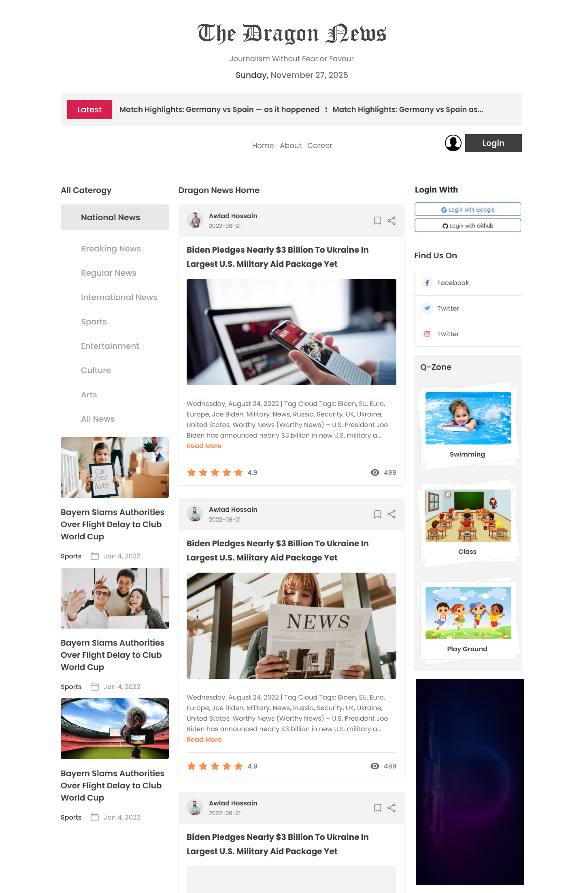
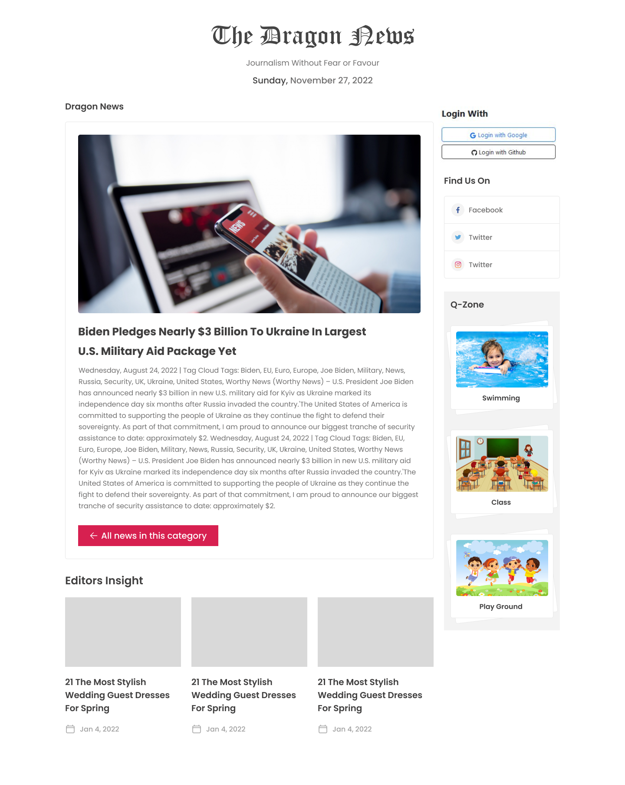
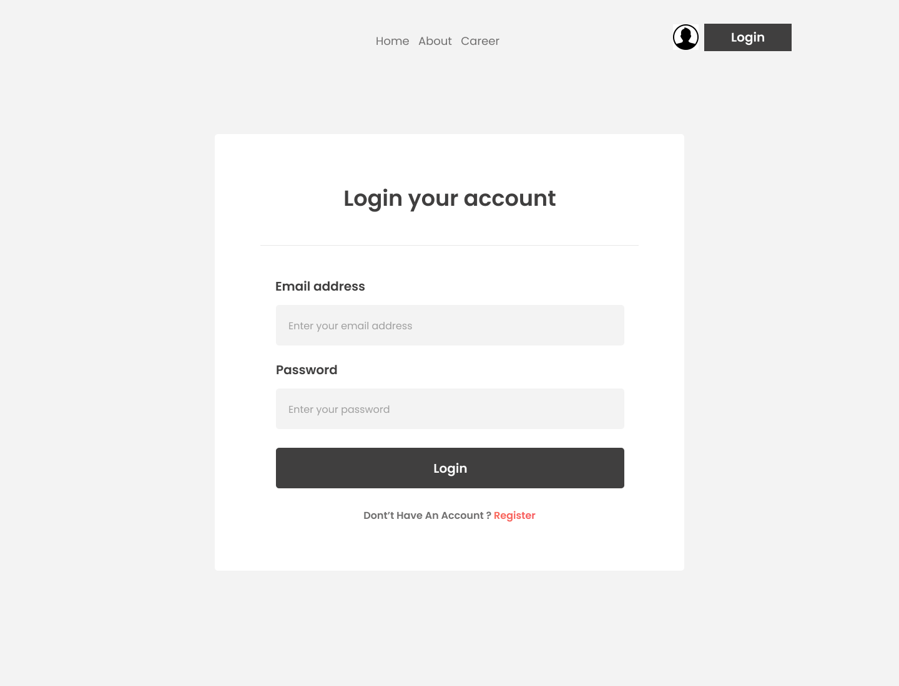
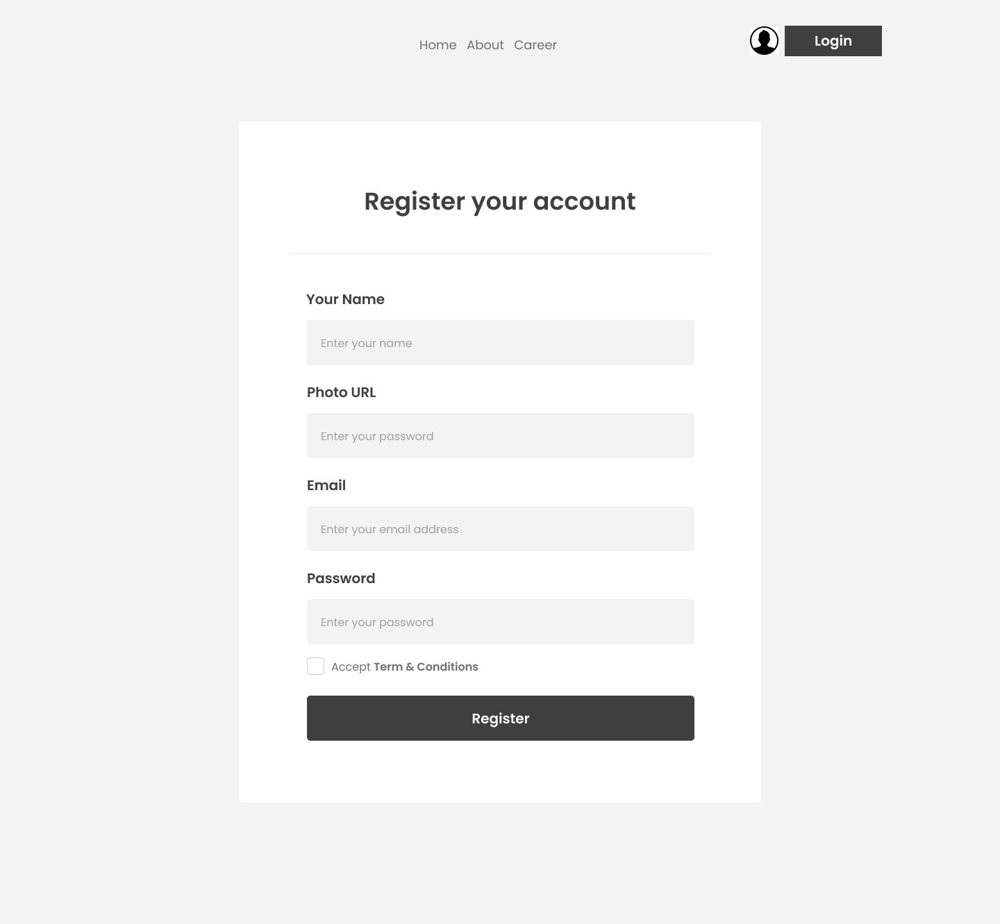

# 

Dragoon News is a responsive front-end web application build with react that delivers real-time news articles on a variety of topics, complete with user authentication for personalized access. Built with modern web technologies, the app ensures a seamless user experience across devices and secure login functionality using firebase authentication.let's build the project together. 😎

## API Documentation

The Dragoon News project utilizes the Programming Hero News API to fetch news categories, articles by category, and detailed news information. Below are the endpoints used in this project.

### Base URL

The base URL for the API is:
[https://openapi.programming-hero.com/api](https://openapi.programming-hero.com/api)

### Endpoints

1. **Get All News Categories**

   - **URL**: `/news/categories`
   - **Full URL**: https://openapi.programming-hero.com/api/news/categories
   - **Method**: `GET`
   - **Description**: Retrieves a list of all available news categories.

2. **Get All News in a Category**

   - **URL Format**: `/news/category/{category_id}`
   - **Full URL Example**: https://openapi.programming-hero.com/api/news/category/01
   - **Method**: `GET`
   - **Description**: Retrieves all news articles within a specified category.
   - **Path Parameter**:
     - `category_id` (string): The unique ID of the category.

3. **Get News Detail by ID**
   - **URL Format**: `/news/{news_id}`
   - **Full URL Example**: https://openapi.programming-hero.com/api/news/0282e0e58a5c404fbd15261f11c2ab6a
   - **Method**: `GET`
   - **Description**: Retrieves detailed information about a specific news article.
   - **Path Parameter**:
     - `news_id` (string): The unique ID of the news article.

## Layout Documentation

There will be three layour for the project. watch below designs to understand layout structure/

### Home Layout

 

### News-Details Layout

 

### Auth Layout

<table>
 <tr>
   <td> </td>
   <td> </td>
 
 </tr> 
</table>
